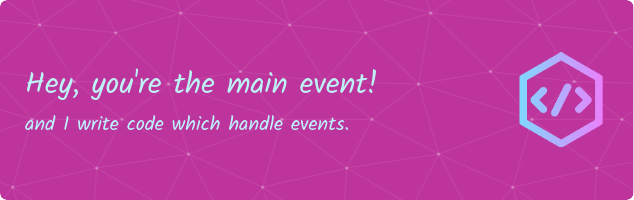

###

  
  

<i>Note: Looking for new opportunity in Frontend development.</i>

###
<h1 align="left">I'm Shubham 👋</h1>
<h3 align="left">📌 Frontend developer from India 🇮🇳</h3>

###
- 🔭 I’m currently working on **React.js or related stack.**

- 🌱 I’m currently learning **TypeScript.**

- 🎯 Goal is to hone **Full Stack Development.**

- 🤝 I’m looking to contribute **to Open Source.**

- 💬 Ask me about **anything, I am happy to help.**

- 📫 How to reach me: **shubhamchasing@gmail.com**

- ⚡ Fun fact: **We all imitate confidence🎭**

###

<h3 align="left">🛠 Worked in past or currently working but not limited</h3>

###

  
  
  
  
  
  
  
  
  
  
  
  
  
  
  
  
  
  
  
  
  
  
  
  
  
  
  

###
